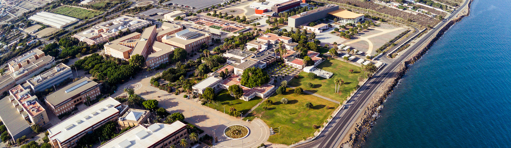

# 💻 Computer Engineering Degree - UAL

---

## 🚀 About This Repository / Sobre Este Repositorio

|  English |  Español |
| :--- | :--- |
| This repository compiles all the practical work and projects I will develop throughout my degree. | Este repositorio recopila el trabajo práctico y proyectos que iré desarrollando durante la carrera. |

---

## 📚 Curriculum Structure / Estructura del Grado

### Year 1 / Primer Año (2025 - 2026)
* **[Introduction to Programming / Introducción a la Programación (IP)](./year-1/introduction-to-programming)**
* **[Programming Methodology / Metodología de la Programación (MP)](./year-1/programming-methodology)**
* **[Statistics / Estadística (R)](./year-1/statistics)**
* **[Logic and Algorithms / Lógica y Algorítmica (LA)](./year-1/logic-and-algorithms)**

---

##  🛠️ Tech Stack & Skills / Tecnologías y Habilidades

### 💬 Languages / Lenguajes

